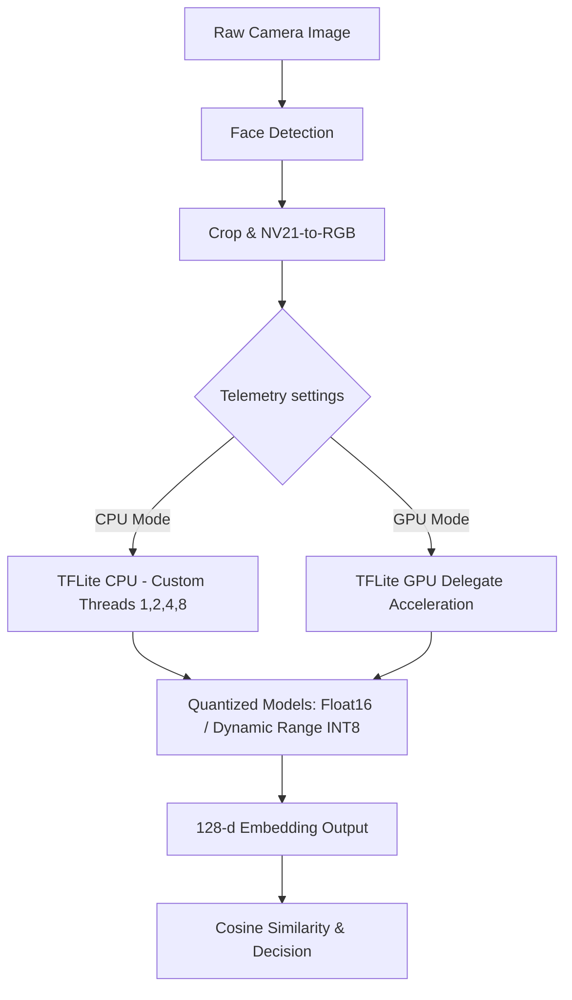

# Face Recognition Performance Analysis & Inference Optimization Report

We have performed an in-depth analysis of the high inference latency (210.93ms) reported during CPU-only execution and designed a dynamic, real-time optimization system.

---

## 1. Deep Analysis: Why is CPU Inference Latency High (210.93ms)?

Running deep learning model inference in real-time on mobile CPUs presents several hardware and software challenges. For a model like MobileFaceNet, a latency of **210.93ms** is highly restrictive, preventing real-time 15+ FPS throughput. Below are the key contributing factors:

### A. Arithmetic Complexity & Precision Overhead (Float32)
* **The Factor:** The default model, `mobilefacenet_baseline_f32.tflite` (4.0MB), uses full 32-bit floating-point weights and activations.
* **The Impact:** Every convolutional layer requires millions of floating-point multiply-accumulate (MAC) operations. Mobile CPU arithmetic logic units (ALUs) have limited floating-point throughput compared to dedicated hardware accelerators.

### B. big.LITTLE Thread Synchronization Barrier (Straggler Effect)
* **The Factor:** Modern mobile SoC CPUs use asymmetric multi-core architectures (e.g., 2 or 4 high-performance "big" cores combined with 4 or 6 energy-efficient "little" cores).
* **The Impact:** Setting thread count to **4** causes the operating system scheduler to distribute TFLite workloads across both big and little cores. TFLite splits the execution of each layer among the threads and synchronizes them at the boundary of every layer. As a result, the performance is bound by the slowest thread running on a "little" core (known as the *straggler effect*). For lightweight networks, 2 threads or even 1 thread can perform faster than 4 threads due to decreased context-switching and synchronization overhead.

### C. Memory Bandwidth & Cache Pressure
* **The Factor:** A 4.0MB float32 model represents a substantial amount of parameters that must be continuously loaded from main system RAM into the CPU's L1/L2/L3 cache hierarchies.
* **The Impact:** Memory access is orders of magnitude slower than CPU calculations. When cache misses occur, the CPU stalls while waiting for weights, which increases latency.

### D. Thermal Throttling
* **The Factor:** Running 4 CPU threads at 100% capacity generates significant heat.
* **The Impact:** Mobile devices have passive cooling. Within seconds, the thermal daemon triggers CPU throttling, lowering the core clock speeds to prevent overheating, which causes latency to spike.

### E. Lack of Hardware Acceleration (GPU Delegate)
* **The Factor:** The model is evaluated entirely on the CPU without utilizing mobile GPU shaders (OpenGL ES / Vulkan).
* **The Impact:** GPUs are designed to process massive parallel workloads. By bypassing the GPU, the system misses out on parallelized matrix multiplication.

---

## 2. Implemented Optimization Strategies

To address these bottlenecks, we have implemented a dynamic performance tuning system that allows you to configure optimization strategies and measure their impact in real-time.

### 1. GPU Delegate Acceleration
We updated both the main thread recognizer and the background isolate execution loop to support the **TFLite GPU Delegate** (`GpuDelegate()`). 
* **Expected Result:** GPU acceleration can reduce MobileFaceNet inference latency from **210ms to under 15ms**, achieving smooth 30 FPS tracking.

### 2. Model Quantization Support
The application now supports dynamically switching between three different model representations:
1. **Baseline Float32 (`mobilefacenet_baseline_f32.tflite` - 4.0MB):** Full precision, higher math complexity.
2. **Float16 Quantized (`mobilefacenet_float16.tflite` - 2.0MB):** Halves the weight size, runs efficiently on hardware supporting FP16 calculations.
3. **Dynamic Range Quantized (`mobilefacenet_dynamic_range.tflite` - 1.2MB):** Quantizes weights to INT8. Activations are dynamically quantized during execution, reducing memory traffic by 70%.

### 3. CPU Thread Tuning
We added a configuration to change the CPU thread count dynamically (1, 2, 4, or 8 threads) to let you find the optimal configuration for your device.

---

## 3. Analysis & Fix: "Model AI belum siap" Error on Registration Screen

### A. Root Cause Analysis
1. **Inference Threading Difference:** Unlike `recognition_screen.dart` which offloads inference execution to a background isolate, `registration_screen.dart` performs face embedding extraction directly on the main UI thread using the `Recognizer` singleton.
2. **GPU Delegate Incompatibility / Load Failures:** If a user configures GPU Acceleration in settings, the `Recognizer` singleton tries to load the model with the `GpuDelegate()`. On devices or emulators that lack full OpenGL/Vulkan/OpenCL driver support for TFLite GPU delegates, `Interpreter.fromAsset` throws a driver/hardware exception.
3. **Missing Main Thread CPU Fallback:** Our previous refactor removed the fallback catch block in the main thread's `loadModel()` method. Thus, any loading failure (such as a GPU delegate rejection) marked `_isLoaded = false` permanently.
4. **Cached Fail State (`_initFuture` Lock):** The initialization of the `Recognizer` is cached via the `_initFuture` instance variable. Once it fails, calling `init()` again immediately returns the completed future with the failed state, preventing subsequent retries.

### B. Solution Implementation
We have resolved this issue by implementing two layers of protection inside `lib/machinelearning/recognizer.dart`:
1. **Robust CPU Fallback:** If `loadModel()` fails to initialize with custom thread settings or a GPU delegate, it catches the exception and attempts to load the interpreter on the CPU without any special delegates.
2. **Initialization Reset on Failure:** In `init()`, we check if `isReady` is false. If it is, we reset `_initFuture = null` to allow a fresh model load attempt.

---

## 4. How to Perform A/B Performance Testing

A **Settings** button has been added directly to the green OSD overlay on the camera screen. Clicking it opens a bottom sheet with these options:

1. **Select Model Quantization:** Choose between *Baseline*, *Float16*, or *Dynamic Range*.
2. **Execution Hardware:** Choose between *CPU Only* or *GPU Delegate*.
3. **CPU Threads:** (Only visible in CPU mode) Choose *1*, *2*, *4*, or *8* threads.

### Applying Changes
When you click **Apply & Restart Isolate**:
* The current background isolate is cleanly terminated (`_recognitionIsolate?.kill()`).
* The interpreter is re-initialized with the new configuration.
* The background isolate is restarted and loaded with the selected model's bytes and delegates.
* The performance tracker is reset to record clean metrics.

This provides an interactive research platform to compare performance characteristics for your paper.
